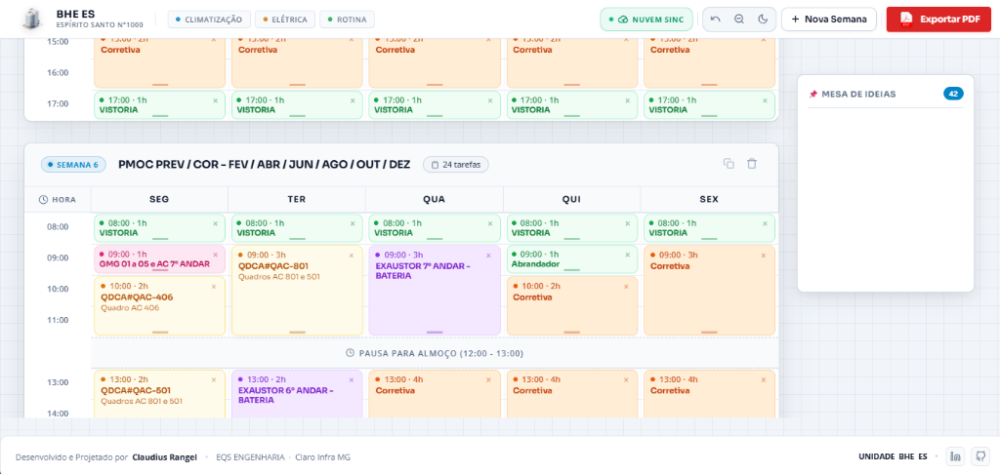
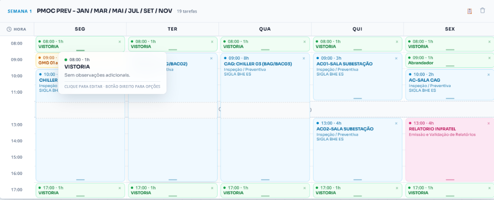

# Cronograma de Manutenção Preventiva e Corretiva

Plataforma web de gestão de manutenção preventiva e corretiva predial e industrial, desenvolvida no padrão **Apple Executive Design System (SF Pro)** com sincronização permanente na nuvem, múltiplos cronogramas e motor de exportação PDF de alta precisão A4 Paisagem.

---

## Visualização da Aplicação

### Interface Principal e Dashboard Interativo


### Motor de Exportação PDF Executivo A4 Paisagem


---

## Principais Funcionalidades

### 1. Motor de PDF Executivo Adobe Red (Ink-Friendly)
- **Menu Dropdown Integrado**: Acesso direto pelo botão **PDF** no mesmo tom e material vermelho Adobe.
- **Formato 2 Semanas por Página**: Layout compacto A4 Paisagem ideal para relatórios de diretoria e reuniões executivas.
- **Formato 1 Semana por Página (Ampliada)**: Layout solo com células expandidas e centralizadas para equipes técnicas de campo.
- **Visual Econômico em Tinta**: Fills com 3% de opacidade e borda lateral de destaque de 3px para cada categoria.
- **Rodapé Institucional**: Exibição da contagem de páginas, versão, unidade e direitos em todas as folhas do documento.

### 2. Gestão Multi-Cronograma e Perfis Independentes
- **Alternância de Perfis**: Seletor no cabeçalho para gerenciar múltiplas unidades (ex: `BHE ES`, `MG CEN 00`) de forma isolada.
- **Criação e Duplicação**: Permite criar novos cronogramas do zero ou duplicar um cronograma existente.
- **Exclusão Protegida**: Confirmação de segurança com validação por palavra-chave (`EXCLUIR`).

### 3. Motor de Sincronização Permanente na Nuvem (`JSONBin.io`)
- **Sincronização em Tempo Real**: Envio e recebimento automático de alterações via API REST.
- **Indicador de Status**: Cápsula interativa no cabeçalho exibindo o estado da conexão (`NUVEM SINC` / `MODO LOCAL`).
- **Resiliência e Fallback**: Salvamento automático no `LocalStorage` em caso de instabilidade de rede.

### 4. Sistema Interativo de Agendamento
- **Física de Arrasto de Precisão (Drag & Drop)**: Arrasto de tarefas com proxy translúcido de rotação fluida.
- **Redimensionamento Vertical**: Ajuste de duração (1h a 7h) com cálculo de colisão automatizado.
- **Cálculo da Pausa de Almoço**: Ponte flutuante indicando o intervalo das 12:00 às 13:00.
- **Mesa de Tarefas Flutuante**: Área de rascunho translúcida para armazenar cartões pendentes de alocação.
- **Filtros por Categoria**: Destaque e translucidez de 9 categorias operacionais (`HVAC`, `Elétrica`, `Rotina`, `Infratel`, `Relatórios`, `Corretiva`, `Refrigeração`, `Hidráulica` e `Especial`).

---

## Estrutura da Tabela de Horários

| Horário | Período | Descrição do Slot |
| :---: | :---: | :--- |
| `08:00` | Manhã | Início das operações matutinas |
| `09:00` | Manhã | Manutenções de rotina e climatização |
| `10:00` | Manhã | Inspeções técnicas |
| `11:00` | Manhã | Fechamento do turno matutino |
| `12:00` | Almoço | Intervalo de refeição e descanso (12:00 - 13:00) |
| `13:00` | Tarde | Início das operações vespertinas |
| `14:00` | Tarde | Manutenções prediais e elétricas |
| `15:00` | Tarde | Inspeções de subestação e geradores |
| `16:00` | Tarde | Relatórios e checagens finais |
| `17:00` | Tarde | Encerramento do turno operacional |

---

## Arquitetura de Software

```
cronograma/
├── index.html              # Estrutura HTML5 semântica e modais
├── script.js               # Motor de estado, drag & drop, nuvem e PDF
├── styles.css              # Sistema de design Apple SF, dark mode e print rules
├── assets/                 # Imagens de preview e ícones oficiais
│   ├── dashboard_preview.png
│   ├── pdf_print_preview.png
│   ├── building_icon.png
│   └── pdf_icon.png
└── .skills/                # Habilidades instaladas no ambiente
```

---

## Como Executar Localmente

1. Clone o repositório:
   ```bash
   git clone https://github.com/claudiusnoc/cronograma.git
   cd cronograma
   ```

2. Execute um servidor HTTP local simples:
   ```bash
   python -m http.server 8000
   ```

3. Acesse no navegador:
   ```
   http://localhost:8000
   ```

---

## Desenvolvido Por

- **Claudius Rangel** · EQS ENGENHARIA · Claro Infra MG
- **Versão**: `v.0.0.7`
- **Licença**: Uso Institucional e Corporativo
